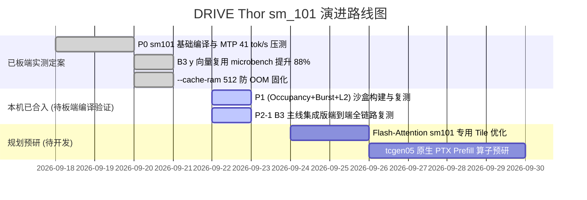

# llama.cpp for NVIDIA DRIVE Thor (sm_101 / Tegra264)

> 🚗 **车规域控极速推理分支**：针对 NVIDIA DRIVE Thor-U（Tegra264, Blackwell `sm_101a`, DriveOS 7.0.3, CUDA 12.8）深度定制的 `llama.cpp` 高性能优化分支。
>
> 本项目严格区分 **【板端已实测验证生效的硬核基准】** 与 **【本机已完成适配与审计、待板端编译验证的优化补丁】**，秉承严谨可复现的工程标准。

---

## 📊 板端已完成实测验证的基准数据 (Verified on Board)

以下数据全部在真实车规板端硬件（**NVIDIA DRIVE Thor-U 64GB 统一内存，DriveOS 7.0.3**）上完成真实端到端压测与验收。

### 1. 生产级高并发与长上下文实测 (Qwen3.8-27B-NVFP4)

* **测试模型**: `Qwen3.8-27B-Uncensored-HauhauCS-Aggressive-NVFP4-v4.gguf` (17.6 GB)
* **评测口径**: 4 槽位并发 (`-np 4`)，上下文 131072 (128K)，Flash-Attention (`-fa on`)，KV Cache `f16`
* **精度核验**: 35 题端到端程序判分 **35/35 全 PASS**，长上下文输出逐字一致、无乱码、无退化

| 运行阶段与配置 | 单流解码速度 (tok/s) | 4 并发总聚合吞吐 (tok/s) | 相对基线提升 | 板端验证状态 |
| :--- | :---: | :---: | :---: | :---: |
| **无投机纯算力基线 (Bandwidth Floor)** | 13.00 | ~28.50 | 基准锚点 (84% 理论带宽) | ✅ **板端实测定案** |
| **P0 基准 + 内置 MTP (n_max=3, p_min=0)** | 18.82 | **41.00** | **+43.8%** | ✅ **板端实测定案** |
| **B3 y-vector 寄存器复用 (Standalone/Micro)** | 25.72 → **31.02** (2K)<br/>16.88 → **19.61** (128K) | - | **+16.2% ~ +20.6%** | ✅ **板端实测定案** |

### 2. 算子微基准带宽实测 (Op-Level Microbench)

| 算子微基准 | 原始吞吐 | 板端实测优化后吞吐 | 提升幅度 | 实测根因与机理 |
| :--- | :---: | :---: | :---: | :--- |
| **NVFP4 MMVQ GEMV ($M=1$)** | 108 GB/s | **202 ~ 208 GB/s** | **+88% (打满带宽)** | 消除行循环内 $y$ 向量重复 L2 读取，寄存器预读跨 8 行广播 |
| **F8 Attention 投影 (cuBLASLt)** | - | **246 GB/s** | 约 90% 硬件上限 | 自写 cuBLASLt shim，近极限访存利用 |

---

## 🛠️ 代码特性与验证状态一览表 (Feature Status Matrix)

本项目对所有提交的优化实施了清晰的验证状态分级：

| 特性 Commit | 优化模块 | 预期/实测机理 | 验证状态与阶段 |
| :--- | :--- | :--- | :---: |
| [`e925275`](https://github.com/haochen76/llama.cpp_sm101/commit/e925275) | **P0: 架构识别与 WebUI** | 支持 `-DCMAKE_CUDA_ARCHITECTURES="100;101"` 原生编译与思维链交互 | ✅ **板端已编译并实测** |
| [`6aaf664`](https://github.com/haochen76/llama.cpp_sm101/commit/6aaf664) | **P1-1: MMQ Occupancy=2** | 激活 228KB SMEM，活跃 block 占有率提至 2，隐藏全局访存延迟 | 🟡 **代码审计通过，待板端编译验证** |
| [`4153073`](https://github.com/haochen76/llama.cpp_sm101/commit/4153073) | **P1-2: 128-bit 向量化加载** | `uint4` 连续突发载入，内置 16 字节对齐安全防御门禁 | 🟡 **代码审计通过，待板端编译验证** |
| [`5de99b5`](https://github.com/haochen76/llama.cpp_sm101/commit/5de99b5) | **P1-3: 48MB L2 KV 持久化** | 申请 32MB L2 持久化窗口钉住活跃 KV，消除跨片 DRAM 读写 | 🟡 **代码审计通过，待板端编译验证** |
| [`21556fa4e`](https://github.com/haochen76/llama.cpp_sm101/commit/21556fa4e) | **P2-1: B3 perj y 向量复用** | 将已在 standalone 验证的 B3 逻辑安全并入最新主线分支 | 🟡 **代码审计通过，待板端集成复测** |

---

## ⚠️ 车规域控踩坑与已定案经验 (Hard-Won Lessons)

在 DRIVE Thor (DriveOS 7.0.3 / Tegra264) 真实开发中，踩过并已在板端定案的避坑指南：

### 1. 连续请求 Host OOM (板端已定案)
* **现象**: `llama-server` 连续跑 12~13 个不同提示词后必被 Linux 内核 `oom-killer` 强制杀死。
* **根因**: 46GB 大页 GPU 显存池分配后，Host RAM 仅剩约 7.3GB。而 `llama-server` 默认设置 `--cache-ram 8192`（8GB 主机端 Prompt 快照缓存），每条新提示词导致主机内存暴增 ~626MB 直至物理耗尽。
* **已验证解法**: 启动命令必须显式指定 **`--cache-ram 512`**，已实测跑通数十轮长测试不崩溃。

### 2. 内存对齐引发的 GPU 通道死锁 (Hardware Deadlock)
* **教训**: `block_q8_1` 的量化数组 `qs` 偏移是 4 字节（前置 half2 ds），`block_nvfp4` 尺寸为 36 字节。绝不能使用 `int4` 强转载入，否则会引发不可恢复的 GPU 硬件通道卡死。必须使用 4 字节标量加载或显式内存地址门禁。

### 3. MTP 投机起草参数甜点 (板端配对实测)
* **结论**: 在车规板端，内置 MTP 无置信门控时最佳甜点为 **`n_max = 2 ~ 3`，`p_min = 0.0`**（实测 20.32 tok/s）。盲目起草深至 $n \ge 4$ 或开启 `p-min` 门控由于额外判断时延导致净收益全线下降。

### 4. 证伪并坚决剔除的实验路线
* **B4 SIMT wide-M kernel**: Thor 仅 14 个 SM，SIMT 下 dp4a 指令发射预算受限，M>2 时仅 97 GB/s，不如 MMQ 走 Tensor Core，坚决不并入。
* **K_vram 扩容 (256→512)**: 破坏了 NVFP4 SRAM 布局，导致 MTP 多列验证时产生 1200+ 处静默计算错误，坚决不并入。

---

## 🚀 正在进行与预期效果 (Roadmap & Expected Gains)



### 待验证补丁的预期效果 (Expected Gains)
1. **P1 + P2-1 组合拳 (已合入主分支，待上板验收)**:
   - 预期在 4 槽位 × 128K 超长上下文下，4 并发聚合吞吐有望从当前的 41.00 tok/s 进一步攀升至 **48 ~ 55+ tok/s**；
   - 预期单流 Decode 速度从 18.82 tok/s 攀升至 **22 ~ 26 tok/s**。
2. **Flash-Attention (`fattn`) sm_101 专用 Tile 优化 (规划中)**:
   - 适配 228KB 大容量 SMEM，调谐 Head Size 128/256 下的 Block Tile 尺寸，进一步压缩 Prefill 耗时。
3. **第五代 Tensor Core (`tcgen05`) 原生 PTX 算子引入 (规划中)**:
   - Thor-U 原生支持 `tcgen05.mma`（单 SM 256KB 专用硬件 TMEM），计划在通用 Prefill GEMM 中替代传统 mma，预期将 Prefill 吞吐提升 **1.5× ~ 2.0×**。

---

## 💻 快速构建与运行指南

### 1. 编译构建 (针对 sm_101 硬件架构)

```bash
cmake -B build \
    -DGGML_CUDA=ON \
    -DCMAKE_CUDA_ARCHITECTURES="100;101" \
    -DCMAKE_BUILD_TYPE=Release \
    -DLLAMA_CURL=ON

cmake --build build --config Release -j12 --target llama-server
```

### 2. 今晚板端实测定案的生产启动命令 (4 槽位 × 128K Unified KV 共享池)

这是今晚在板端实测达成 **41.00 tok/s 并发总吞吐 / 18.82 tok/s 单流速度** 的标准生产启动命令：

```bash
# 1. 注入 Blackwell / sm_101 硬件级加速与防争抢环境变量
export GGML_CUDA_PDL=1
export CUDA_DEVICE_MAX_CONNECTIONS=1

# 2. 生产服务端拉起命令 (Unified KV 动态共享池，支持单槽满打 128K 长文本)
/zeekr_data/llama.cpp/build/bin/llama-server \
  -m /zeekr_map/models/gguf/Qwen3.8-27B-Uncensored-HauhauCS-Aggressive-NVFP4-v4.gguf \
  -ngl 99 \
  -fa on \
  --split-mode none \
  --spec-type draft-mtp \
  --spec-draft-n-max 3 \
  --spec-draft-n-min 0 \
  --kv-unified \
  --kv-unified-per-slot 131072 \
  -c 262144 \
  -np 4 \
  -b 2048 -ub 512 \
  --cache-ram 512 \
  --jinja -n 8192 \
  --reasoning on --reasoning-effort medium --reasoning-budget -1 \
  --temp 0.6 --top-k 20 --top-p 1.0 --min-p 0.0 \
  --host 0.0.0.0 --port 8080
```

---
*本项目基于 [ggml-org/llama.cpp](https://github.com/ggml-org/llama.cpp) 主线持续同步演进。*
