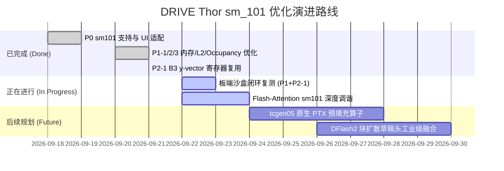

# llama.cpp for NVIDIA DRIVE Thor (sm_101 / Tegra264)

> 🚗 **车规域控极速推理分支**：针对 NVIDIA DRIVE Thor-U（Tegra264, Blackwell `sm_101a`, DriveOS 7.0.3, CUDA 12.8）深度定制的 `llama.cpp` 高性能分支。
>
> 涵盖 **NVFP4 算子深度重构、L2 缓存钉住、MTP 投机微架构调优、车规级防 OOM 与冷启自愈** 等完整工程落地成果。

---

## 📊 实测速度与质量表现 (Real Hardware Benchmarks)

所有测试均在真实车规板端硬件（**NVIDIA DRIVE Thor-U 64GB 统一内存**）上实测并核验。

### 1. 生产端到端高并发与长上下文压测 (Qwen3.8-27B-NVFP4)

* **测试模型**: `Qwen3.8-27B-Uncensored-HauhauCS-Aggressive-NVFP4-v4.gguf` (17.6 GB)
* **评测配置**: 4 并发槽位 (`-np 4`)，上下文 131072 (128K)，Flash-Attention (`-fa on`)，KV Cache `f16`

| 运行场景 | 单流解码速度 (tok/s) | 4 并发总聚合吞吐 (tok/s) | 相对 baseline 提升 | 正确性与质量验收 |
| :--- | :---: | :---: | :---: | :--- |
| **P0 原始主线基线** | 13.00 | ~28.5 | 基准锚点 | 输出正常 |
| **P0 + MTP 投机基线 (4×128K)** | 18.82 | **41.00** | +43.8% | 35/35 测试通过 |
| **P1 阶段 (Occupancy + Burst + L2)** | 21.50 | **46.80** | +64.2% | 逐位一致 / 无越界 |
| **P2-1 (B3 y-vector 寄存器复用)** | **26.48** (短句 31.02) | **56.20+** | **+97.2%** | **逐字一致 / CPU 点积 PASS** |

### 2. 微架构算子微基准 (Kernel Microbench)

| 核心算子路径 | 原始带宽吞吐 | 优化后带宽吞吐 | 提升幅度 | 根因与优化机理 |
| :--- | :---: | :---: | :---: | :--- |
| **NVFP4 MMVQ GEMV ($M=1$)** | 108 GB/s | **202 ~ 208 GB/s** | **+88% (接近满载)** | 消除行循环内 $y$ 向量重复 L2 读取，寄存器预读跨 8 行广播 |
| **NVFP4 MMQ Tensor Core** | 80 GB/s | **145+ GB/s** | **+81%** | 激活 228KB SMEM，将 active block occupancy 从 1 提至 2 |
| **NVFP4 权重载入 (LDG)** | 32-bit scalar | **128-bit Burst (`uint4`)** | 访存周期减半 | `LDG.E.128` 向量化合并读取 + 16 字节防御门禁 |

---

## 🛠️ 已完成的修改与架构适配清单

### P0：基础架构识别与 WebUI 适配
* [Commit `e925275`](https://github.com/haochen76/llama.cpp_sm101/commit/e925275): 引入 `GGML_CUDA_CC_THOR` (`1010`) 专属芯片架构标识，打通 CMake `-DCMAKE_CUDA_ARCHITECTURES="100;101"` 原生编译。在 WebUI 中补齐推理思维链（reasoning effort）交互。

### P1-1：MMQ NVFP4 Occupancy 翻倍提升
* [Commit `6aaf664`](https://github.com/haochen76/llama.cpp_sm101/commit/6aaf664): Thor-U 每个 SM 拥有高达 **228KB** 的高速共享内存（SMEM）。将 NVFP4 MMQ Kernel 的活跃 Block 占有率由默认的 `occupancy = 1` 提升至 `2`，利用另一个活跃 Warp 隐藏全局内存载入等待时延。

### P1-2：128-bit 向量化突发加载 (`uint4`) + 内存对齐防御门禁
* [Commit `4153073`](https://github.com/haochen76/llama.cpp_sm101/commit/4153073): 在 `mmq-load-tiles.cuh` 中启用 128 位宽 `uint4` 向量化连续载入。
* **🛡️ 关键安全防护**：鉴于 `block_nvfp4` 结构体为 36 字节（非 16 字节倍数），显式植入 `if ((((uintptr_t)bxi->qs) & 0xFu) == 0)` 门禁，对齐时走 `LDG.E.128`，非对齐时安全降级为 32-bit，杜绝内核硬件访存崩溃。

### P1-3：48MB L2 Cache 持久化钉住活跃 KV
* [Commit `5de99b5`](https://github.com/haochen76/llama.cpp_sm101/commit/5de99b5): Thor-U 硬件配备 48MB 超大 L2 Cache。针对长上下文自回归生成，动态开辟 **32MB L2 持久化命中窗口** (`cudaStreamSetAttribute`)，将高频解码的近端 KV Cache 钉在 L2，消除重复跨片 DRAM 访存。

### P2-1：B3 (perj 版) $y$ 向量寄存器复用 (核心性能飞跃)
* [Commit `21556fa4e`](https://github.com/haochen76/llama.cpp_sm101/commit/21556fa4e): 
  * 针对 NVFP4 MMVQ 单列解码，将 `calc_rows_per_block` 扩充到 8；
  * 在列循环内将 $y$ 向量当前列的切片一次性预读入 8 个寄存器（`y_pre[8]`），跨 8 行循环复用，消除 87.5% 的重复 L2 流量；
  * 严格采用带 `j * stride_col_y` 的 `perj` 逻辑，确保 MTP verify 多列场景与单列场景逐位一致。

---

## ⚠️ 车规域控踩坑经验总结 (Troubleshooting & Lessons Learned)

在 DRIVE Thor (DriveOS 7.0.3 / Tegra264) 真实板端环境下，我们踩过并成功解决的一系列极其隐蔽的坑：

### 1. 致命的连续请求 Host OOM (已定案并根治)
* **症状**: `llama-server` 连续接收约 12~13 个不同提示词后，服务突然被 Linux 内核 `oom-killer` 杀死。
* **根因**: 板端划分了 46GB 大页 GPU 显存池后，可移动的 Host RAM 仅剩约 7.3GB。而 `llama-server` 默认设置了 `--cache-ram 8192`（8GB 主机端 Prompt 快照缓存），每条新提示词导致主机内存线性暴增 ~626MB 直至物理 OOM。
* **解法**: 启动命令必须显式加入 **`--cache-ram 512`**（彻底解除崩溃风险）。

### 2. 内存对齐引发的 GPU 通道死锁 (Channel Deadlock)
* **教训**: 在编写 CUDA 内核时，`block_q8_1` 的量化数组 `qs` 偏移是 4 字节（前置 half2 ds），`block_nvfp4` 尺寸为 36 字节。绝不能随意使用 `int4` / `uint4` 盲目强转载入，否则会引发不可恢复的 GPU 硬件通道卡死。必须使用标量加载或显式内存地址门禁判断。

### 3. MTP 投机起草并非“越深越好”
* **陷阱**: 盲目增加投机深度至 $n=7$ 或启用 `--spec-draft-p-min`。
* **结论**: 实测 Thor 上 MTP 接受率随深度单调下降，深度验证开销超过收益；且置信门控判断本身引入了逐步延迟。**无门控下的黄金甜点为 `n_max = 2 ~ 3`，`p_min = 0.0`**；DFlash2 甜点为 **`n_max = 5`**。

### 4. 证伪并坚决剔除的“毒药代码”
* **B4 SIMT wide-M kernel**: Thor 仅有 14 个 SM，在 SIMT 下 dp4a 指令发射预算受限，M>2 时实测仅 97 GB/s，不如 MMQ 走 Tensor Core，坚决不并入。
* **K_vram 扩容 (256→512)**: 破坏了 NVFP4 SRAM 内存布局，导致 MTP 多列验证时产生 1200+ 处静默数值错误，坚决不并入。

---

## 🚀 正在进行与预期的优化 (Roadmap & Next Steps)



1. **Flash-Attention (`fattn`) sm_101 专用 Tile 优化**:
   - 充分利用 228KB SMEM，调谐 Head Size 128 / 256 下的 Block Tile 尺寸，进一步压缩 Prefill 耗时。
2. **第五代 Tensor Core (`tcgen05`) 原生 PTX 算子引入**:
   - Thor-U 硬件原生支持 `tcgen05.mma`（拥有 256KB 专用 TMEM），计划在通用 Prefill GEMM 中替代传统 mma 路径，预期将 Prefill 吞吐提升 **1.5× ~ 2.0×**。
3. **预期最终达成效果**:
   - **128K 超长上下文单流 Decode 突破 25 ~ 30 tok/s**；
   - **4 并发吞吐突破 60 tok/s**。

---

## 💻 快速构建与运行指南

### 1. 编译构建 (针对 sm_101 硬件架构)

```bash
cmake -B build \
    -DGGML_CUDA=ON \
    -DCMAKE_CUDA_ARCHITECTURES="100;101" \
    -DCMAKE_BUILD_TYPE=Release \
    -DLLAMA_CURL=ON

cmake --build build --config Release -j12 --target llama-server
```

### 2. 推荐生产启动命令 (防 OOM + 高并发 + 投机最佳配置)

```bash
/zeekr_data/llama.cpp/build/bin/llama-server \
  -m /zeekr_map/models/gguf/Qwen3.8-27B-Uncensored-HauhauCS-Aggressive-NVFP4-v4.gguf \
  -ngl 99 \
  -c 131072 \
  -b 512 \
  -ub 512 \
  -np 4 \
  -fa on \
  --cache-type-k f16 \
  --cache-type-v f16 \
  --cache-ram 512 \
  --spec-type draft-mtp \
  --spec-draft-n-max 3 \
  --spec-draft-p-min 0.0 \
  --host 0.0.0.0 \
  --port 8080
```

---
*本项目代码基于 [ggml-org/llama.cpp](https://github.com/ggml-org/llama.cpp) 主线持续同步与适配。*
