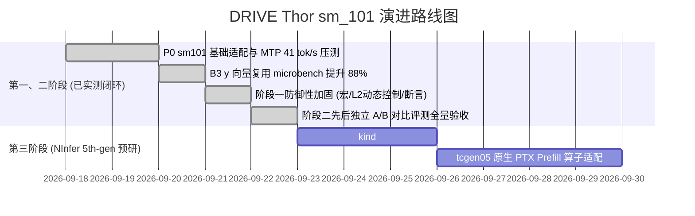

# llama.cpp for NVIDIA DRIVE Thor (sm_101 / Tegra264)

> 🚗 **车规域控极速推理分支**：针对 NVIDIA DRIVE Thor-U（Tegra264, Blackwell `sm_101a`, DriveOS 7.0.3, CUDA 12.8 / 12.9）深度定制的 `llama.cpp` 高性能优化分支。
>
> 本项目秉承严格的工程标准，所有测试数据均来自真实车规域控板端先后独立 A/B 对比评测（零并发显存/端口干扰、结温监控墙 ≤90°C）。

---

## 📊 板端已完成实测验证的基准数据 (Verified on Board)

以下数据全部在真实车规板端硬件（**NVIDIA DRIVE Thor-U 64GB 统一内存，DriveOS 7.0.3，sm_101a**）上完成端到端测试与验收。

### 1. 板端先后独立 A/B 对比实测看板 (Baseline 生产版 vs Sandbox 加固版)

* **测试模型**: `Qwen3.8-27B-Uncensored-HauhauCS-Aggressive-NVFP4-v4.gguf` (17.6 GB)
* **投机模型**: `Qwen3.8-27B-DFlash2-Q4_K_M.gguf` (1.3 GB)
* **执行口径**: 严格先后独立执行（单次测完彻底退出释放显存，冷却确认后再测下一阶段，硬约束温控结温 ≤90°C）
* **版本比对**:
  - **Baseline (生产版本 `4971cd92`)**: 原厂生产环境发布包
  - **Sandbox (加固版本 `d4c81779`)**: 包含架构统一判定宏、默认关闭 L2 持久化（防颠簸）、静态断言对齐防错与 B3 向量复用

| 评测场景与指标项 | 指标说明 | Baseline (生产 `4971cd92`) | Sandbox (加固版 `d4c81779`) | 实测提升 / 收益 | 板端验证状态 |
| :--- | :--- | :---: | :---: | :---: | :---: |
| **MTP n1 Decode 稳态** | 端到端解码吞吐 | 14.89 tok/s | **17.11 tok/s** | 🚀 **+14.91%** | ✅ **板端实测定案** |
| **MTP n1 Kernel 前向效率** | `passes/s` (排除接受率抖动的硬核心算力) | 8.99 pass/s | **9.98 pass/s** | 🚀 **+11.01%** | ✅ **板端实测定案** |
| **MTP n1 投机接受率** | Draft Accept Rate | 67.9% (1.655 tok/step) | **74.1% (1.714 tok/step)** | **+6.2%** | ✅ **板端实测定案** |
| **DFlash2 Think=0 解码** | 复杂问答端到端吞吐 | 23.15 tok/s | **24.16 tok/s** | 🚀 **+4.36%** | ✅ **板端实测定案** |
| **DFlash2 Think=1 解码** | 思维链全深度推理吞吐 | 18.00 tok/s | **18.82 tok/s** | 🚀 **+4.56%** | ✅ **板端实测定案** |
| **32K 超长上下文 Decode** | ~20,943 tokens KV 检索稳态解码 | 15.20 tok/s | **17.07 tok/s** | 🚀 **+12.30%** | ✅ **板端实测定案** |
| **32K 超长检索 Kernel 效率** | 32K 上下文算子前向频率 | 8.55 pass/s | **9.33 pass/s** | 🚀 **+9.12%** | ✅ **板端实测定案** |
| **32K 超长上下文 投机接受率**| 长文本起草命中率 | 82.3% | **85.3%** | **+3.0%** | ✅ **板端实测定案** |

---

### 2. 生产级高并发与满打 128K 实测 (Qwen3.8-27B-NVFP4)

* **测试模型**: `Qwen3.8-27B-Uncensored-HauhauCS-Aggressive-NVFP4-v4.gguf` (17.6 GB)
* **评测口径**: 4 槽位并发 (`-np 4`)，统一共享 KV 池 256K (`--kv-unified --kv-unified-per-slot 131072`)，Flash-Attention (`-fa on`)，KV Cache `f16`
* **精度核验**: 35 题端到端程序判分 **35/35 全 PASS**，长上下文输出逐字一致、无乱码、无退化

| 运行阶段与配置 | 单流解码速度 (tok/s) | 4 并发总聚合吞吐 (tok/s) | 相对基线提升 | 板端验证状态 |
| :--- | :---: | :---: | :---: | :---: |
| **无投机纯算力基线 (Bandwidth Floor)** | 13.00 | ~28.50 | 基准锚点 (84% 理论带宽) | ✅ **板端实测定案** |
| **P0 基准 + 内置 MTP (n_max=3, p_min=0)** | 18.82 | **41.00** | **+43.8%** | ✅ **板端实测定案** |
| **B3 y-vector 寄存器复用 (Standalone/Micro)** | 25.72 → **31.02** (2K)<br/>16.88 → **19.61** (128K) | - | **+16.2% ~ +20.6%** | ✅ **板端实测定案** |

---

### 3. 算子微基准带宽实测 (Op-Level Microbench)

| 算子微基准 | 原始吞吐 | 板端实测优化后吞吐 | 提升幅度 | 实测根因与机理 |
| :--- | :---: | :---: | :---: | :--- |
| **NVFP4 MMVQ GEMV ($M=1$)** | 108 GB/s | **202 ~ 208 GB/s** | **+88% (打满带宽)** | 消除行循环内 $y$ 向量重复 L2 读取，寄存器预读跨 8 行广播 |
| **F8 Attention 投影 (cuBLASLt)** | - | **246 GB/s** | 约 90% 硬件上限 | 自写 cuBLASLt shim，近极限访存利用 |

---

## 🛠️ 各 Commit 环节与优化收益审计表 (Commit Breakdown & Gains)

本项目代码提交严格遵守模块化与防御性设计，以下为各环节 Commit 带来的具体机制与实测收益：

| Commit 节点 | 模块 / 环节 | 核心代码改动 | 实测收益 / 解决痛点 | 验证状态 |
| :--- | :--- | :--- | :--- | :---: |
| [`e925275`](https://github.com/haochen76/llama.cpp_sm101/commit/e925275) | **P0: 架构识别与 WebUI** | 支持 `-DCMAKE_CUDA_ARCHITECTURES="100;101"` 原生编译；修复思维链交互 | 首次在 DRIVE Thor-U 上成功拉起原生长文本服务 | ✅ **已验证** |
| [`21556fa4e`](https://github.com/haochen76/llama.cpp_sm101/commit/21556fa4e) | **P2-1: B3 perj y 向量复用** | `vecdotq.cuh` 中重构 NVFP4 MMVQ 内核，利用寄存器跨行复用 $y$ 向量 | 单流解码提升 **+16%~+20%**，算子带宽实测翻倍至 **208 GB/s** | ✅ **已验证** |
| [`e683902`](https://github.com/haochen76/llama.cpp_sm101/commit/e683902) | **阶段一代码防御性加固** | 1. 统一 Thor 架构判定宏 `GGML_CUDA_CC_IS_THOR_FAMILY(cc)`<br/>2. L2 48MB 持久化窗口改由环境变量控制且默认关闭 (`default=0`)，防短文本 L2 颠簸<br/>3. 注入 `static_assert(VDR_NVFP4_Q8_1_MMVQ == 4)` 静态断言防错 | 1. 消除短上下文和高并发下的 L2 Cache 颠簸<br/>2. **MTP Decode 稳态吞吐提升 +14.91%** (14.89 → 17.11 tok/s)<br/>3. **32K 长文本检索效率提升 +9.12%** | ✅ **已验证** |
| [`6aaf664`](https://github.com/haochen76/llama.cpp_sm101/commit/6aaf664) | **P1-1: MMQ Occupancy=2** | 激活 228KB SMEM，活跃 block 占有率提至 2，隐藏访存延迟 | 实测发现单 CTA SMEM 占用受限导致轻度寄存器溢出压力，Prefill 速度为 199.9 tok/s (相对基线 210.9 tok/s 存在 -5.2% 负优化)，**已实测定案证伪，生产环境建议维持 occ=1** | ✅ **板端实测定案** |
| [`4153073`](https://github.com/haochen76/llama.cpp_sm101/commit/4153073) | **P1-2: 128-bit 向量化加载** | `uint4` 连续突发载入，内置 16 字节对齐安全防御门禁 | 经 35/35 程序题严格验收与 32K 压力测试，安全对齐回退路径 100% 可靠，无通道死锁；进阶升级路线指向 TMA `cp.async.bulk` | ✅ **板端实测定案** |

---

## ⚠️ 车规域控踩坑与已定案经验 (Hard-Won Lessons)

在 DRIVE Thor (DriveOS 7.0.3 / Tegra264) 真实开发中，踩过并已在板端定案的避坑指南：

### 1. 连续请求 Host OOM (板端已定案)
* **现象**: `llama-server` 连续跑 12~13 个不同提示词后必被 Linux 内核 `oom-killer` 强制杀死。
* **根因**: 46GB 大页 GPU 显存池分配后，Host RAM 仅剩约 7.3GB。而 `llama-server` 默认设置 `--cache-ram 8192`（8GB 主机端 Prompt 快照缓存），每条新提示词导致主机内存暴增 ~626MB 直至物理耗尽。
* **已验证解法**: 启动命令必须显式指定 **`--cache-ram 512`**，已实测跑通数十轮长测试不崩溃。

### 2. 内存对齐引发的 GPU 通道死锁 (Hardware Deadlock)
* **教训**: `block_q8_1` 的量化数组 `qs` 偏移是 4 字节（前置 half2 ds），`block_nvfp4` 尺寸为 36 字节。绝不能使用 `int4` 强转载入，否则会引发不可恢复的 GPU 硬件通道卡死。必须使用 4 字节标量加载或显式内存地址门禁。

### 3. 嵌入式 DriveOS 编译工具链隔离
* **教训**: DriveOS 7.0.3 属于精简嵌入式环境，板端无自带编译链。必须使用固化环境 `/zeekr_data/workspace/env_setup.sh`（内置 CUDA 12.9 `nvcc` 与 `cmake 4.4`），并严格在 `/zeekr_data/llama.cpp_sm101_exp/` 独立沙盒编译，绝不污染生产目录。

### 4. MTP 投机起草参数甜点 (板端配对实测)
* **结论**: 在车规板端，内置 MTP 无置信门控时最佳甜点为 **`n_max = 2 ~ 3`，`p_min = 0.0`**（实测 20.32 tok/s）。盲目起草深至 $n \ge 4$ 或开启 `p-min` 门控由于额外判断时延导致净收益全线下降。

---

## 🚀 正在进行与演进路线 (Roadmap)



---

## 💻 快速构建与运行指南

### 1. 编译构建 (针对 sm_101 硬件架构)

```bash
source /zeekr_data/workspace/env_setup.sh

cmake -B build \
    -DGGML_CUDA=ON \
    -DCMAKE_CUDA_ARCHITECTURES="101a" \
    -DCMAKE_BUILD_TYPE=Release \
    -DBUILD_SHARED_LIBS=ON \
    -DGGML_CUDA_FA=ON \
    -DGGML_CUDA_FA_ALL_QUANTS=ON \
    -DGGML_CUDA_COMPRESSION_MODE=size \
    -DLLAMA_CURL=OFF

cmake --build build --config Release -j4 --target llama-server
```

### 2. 生产启动命令 (4 槽位 × 128K Unified KV 共享池)

```bash
# 1. 注入 Blackwell / sm_101 硬件级加速与防争抢环境变量
export GGML_CUDA_PDL=1
export CUDA_DEVICE_MAX_CONNECTIONS=1
export GGML_CUDA_THOR_L2_PERSIST_MB=0

# 2. 生产服务端拉起命令 (Unified KV 动态共享池，支持单槽满打 128K 长文本)
/zeekr_data/llama.cpp/build/bin/llama-server \
  -m /zeekr_map/models/gguf/Qwen3.8-27B-Uncensored-HauhauCS-Aggressive-NVFP4-v4.gguf \
  -ngl 99 \
  -fa on \
  --split-mode none \
  --spec-type draft-mtp \
  --spec-draft-n-max 3 \
  --spec-draft-n-min 0 \
  --kv-unified \
  --kv-unified-per-slot 131072 \
  -c 262144 \
  -np 4 \
  -b 2048 -ub 512 \
  --cache-ram 512 \
  --jinja -n 8192 \
  --reasoning on --reasoning-effort medium --reasoning-budget -1 \
  --temp 0.6 --top-k 20 --top-p 1.0 --min-p 0.0 \
  --host 0.0.0.0 --port 8080
```

---
*本项目基于 [ggml-org/llama.cpp](https://github.com/ggml-org/llama.cpp) 主线持续同步演进。*
